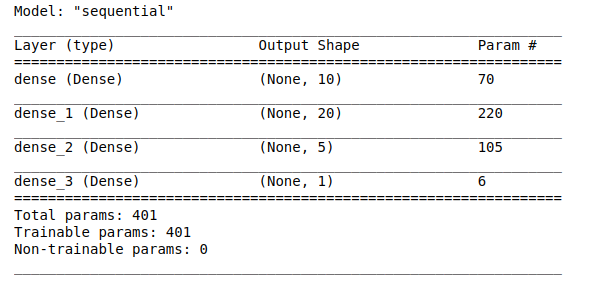
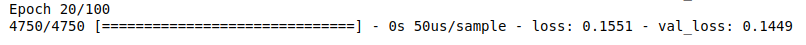
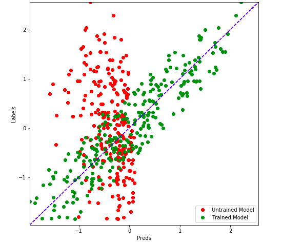

# Predicting-House-Prices-with-Regression
This Code is used to Predict the proces of the house based of the Location, Distance from Major parts of the city and the Age of the house
The Data Set of the [House Pricing]('data.csv') This code uses Tensorflow as the Backend Support for the Machine Learning.

# Screenshots

     This is the Summary of the Layers in the Machine Learning Model

 

 
     The Mode is Trained for 20 epochs, the Initial Value is given as  100 But the Training is made       to come at an early Stop

    

 This is the final result of the Trained Model, it Visualises the predictions the Green points show the Presictions of the Model after the Training, and the Red Dots indicate the Predictions without the Model Training.

